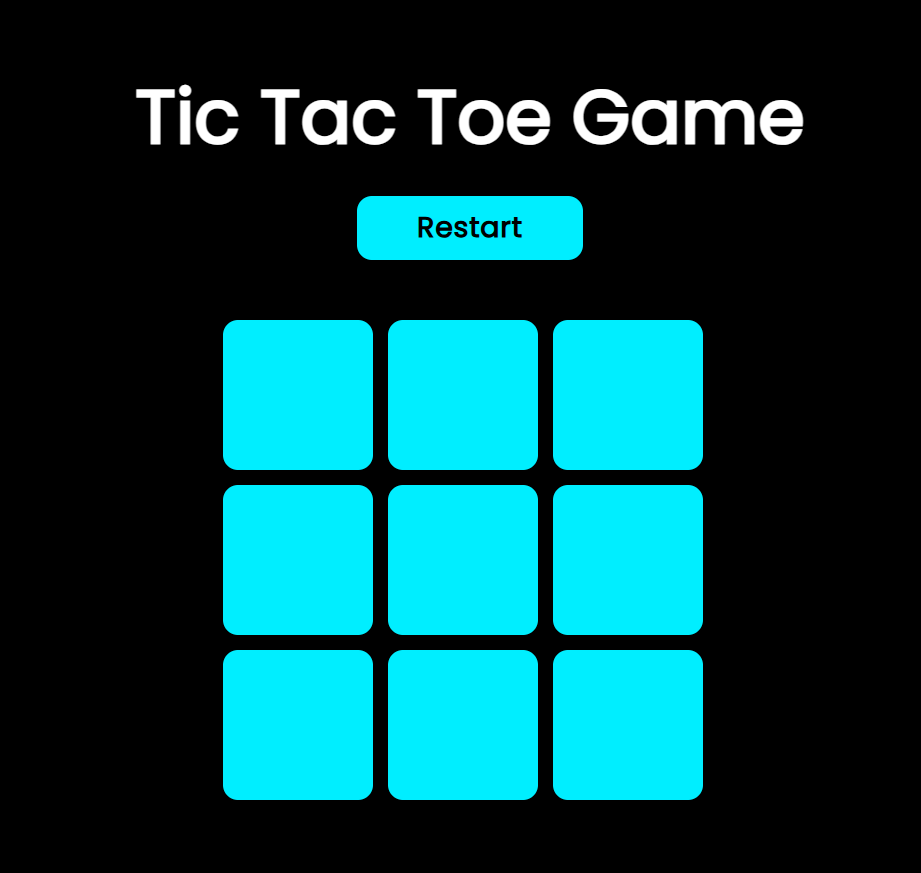

# 🎮 MY TIC TAC TOE TOWN.




## 🧩 Description du projet

**TIC TAC TOE TOWN** est une version web assez minimaliste du célèbre jeu **Morpion (Tic Tac Toe... que j'affectionne particulièrement)**.  
Ce projet a été réalisé en **HTML, CSS et JavaScript** sans frameworks, dans le but d’apprendre à manipuler le **DOM**, la **logique de jeu** et les **événements utilisateurs** côté client.

Le joueur affronte un autre joueur localement (tour par tour) dans une interface que j'ai pensée pour être très ambiance "jeu" et surtout confortable.

---

## Les Fonctionnalités principales

» Interface moderne  
» Alternance automatique des tours entre “X” et “O”  
» Détection automatique du gagnant (ou match nul)  
» Mise en surbrillance des cases gagnantes  
» Bouton **Restart** pour relancer la partie  
» Code clair et facilement personnalisable  

---

## Mes Objectifs pédagogiques (pour ce projet)...

Ce projet m’a permis de consolider plusieurs compétences fondamentales en développement web front-end :

- Manipulation du **DOM** avec JavaScript  
- Utilisation des **événements (click)** pour interagir avec la page  
- Gestion de **tableaux et conditions logiques**  
- Mise à jour **dynamique du contenu HTML**  
- Construction d’une interface **responsive** et conviviale.  

---

## Structure de mon projet :

📁 tic-tac-toe-town/ <br>
├── index.html<br>
├── app.js<br>
├── tictac.css<br>
└── 📁 img/<br>
    ├── p1.png<br>
    ├── p2.png<br>
    ├── p3.png<br>


## Aperçus du site

Voici quelques captures d’écran illustrant le rendu du jeu :

### Écran d’accueil


### Partie en cours


### 🏆 Victoire !


---

## Installation & exécution

1. **Clone** le dépôt :
   ```bash
   git clone https://github.com/Lord-Einstein/my_tic_tac_town.git

2. **It's all ^_~**... :

Lance simplement le fichier :
Ouvre index.html dans ton navigateur et Régale-toi !  
   
3. **BONUS :: Teste Directement !**... :<br>
[**ICI.**](https://lord-einstein.github.io/my_tic_tac_town//)

